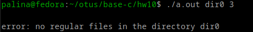

## Домашнее задание №10

- код в файле test1.c
- запуск ./a.out требует двух аргументов - имя директории для тестирования и количество потоков
  - dir0 - пустая директория для тестирования, 
  - dir5, dir6, dir7 - директории с некоторыми файлами логов
  - dir4 - директория со всеми восемью файлами логов
- результаты записываются в файл reply.txt, привожу файлы reply-dir#.txt, полученные в результате выполнения программы
- компиляция и запуск:

```
gcc main.c
./a.out <dir> <N>
# например, ./a.out dir1 4 
```

- результат запуска для пустой директории:




