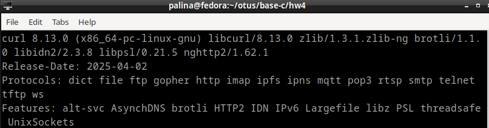

## Домашнее задание №4

- исходный код скачан с официального сайта и распакован в ./curl-8.13.0
- выполнены команды:

```
./curl-8.13.0/configure --without-ssl --disable-shared \
--prefix=$PWD/.. --enable-http --enable-telnet \
--enable-https 

make

./src/curl --version
```


