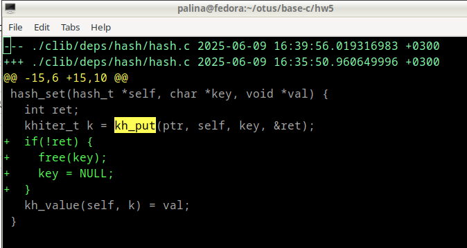

## Домашнее задание №5

- патч - в файле difference.diff
- применение: 

```
patch < difference.diff
```
- если "could not find file to patch" - нужно ввести ./clib/deps/hash/hash.c

- до патча:


- изменение - добавление двух строк (free(...) и ...= NULL) в файл clib/deps/hash/hash.c:



- применение патча:


- после патча:


