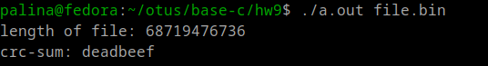

## Домашнее задание №9

- код в файле main.c, для компиляции требуется наличие файла makecrc.c (в нём содержатся таблицы для вычисления crc32 - суммы)
- запуск ./a.out требует один аргумент - путь к файлу для вычисления crc32. Результат - вывод длины файла и сумма crc32 в 16-ричной системе счистения. 

-разархивация:

```
7z file.7z
```

- компиляция и запуск:

```
gcc main.c
./a.out file.bin 
```
- результат:




